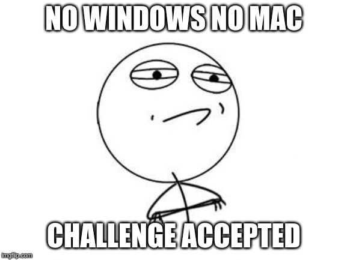
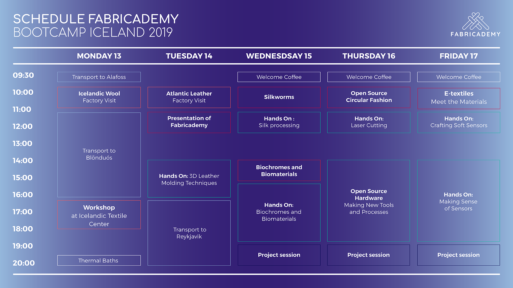

# Fabricademy Iceland 2019

This is Francisco's public repository for Fabricademy Bootcamp May 13-19 2019, Iceland. It has been a long time since I want to join Fabricademy. And the bootcamp is the best place to start grasping this universe.

All the information about the bootcamp is located here: https://bootcamp.textile-academy.org/ There is **only one** bootcamp every year so if you are hesitating, this is the go / no-go point!

## Bootcamp documentation

I read in the [Handbook for the participants](http://fabricademy.fabcloud.io/bootcamp2019) that is recommended to bring a computer with Illustrator, Rhino and Fusion360. I wonder what are those things. I will try to complete the bootcamp using only Linux software.

So this is the plan

## Travel journal

I will arrive a few days before the start of the  bootcamp. I am planning to rent a car and travel around on my own.

### Capturing the Northern Lights

#### Equipment

- Tripod
- Canon EOS M6 with wide angle lens 15-45mm f3.5
- Extra batteries

#### Choosing time and location

- Light pollution [map](https://www.lightpollutionmap.info/#zoom=6&lat=9560212&lon=-1968356&layers=B0FFFFFTFFFF) in Iceland
- Iceland [cloud cover](https://en.vedur.is/weather/forecasts/aurora/#type=composite) and [Kp-index](http://www.spaceweatherlive.com/en/help/the-kp-index) forecast
- NOAA Aurora 30 minutes [forecast](https://www.swpc.noaa.gov/products/aurora-30-minute-forecast)
- Moon Phase in [Iceland](https://www.timeanddate.com/moon/phases/iceland/reykjavik)
- Probability of seeing [Auroras](https://earth.nullschool.net/#current/space/surface/level/anim=off/overlay=aurora/orthographic=-23.77,64.99,2787/loc=85.521,-55.393) Click on the map for the value

#### Photography tips

- Use RAW format
- Metering mode: Center weighted average
- Color temperature K 2800-4000
- Focus at infinity
- Aperture f2.8 preferred. f3.5 or f4 also work well
- ISO as low as possible. Start at 400-800. If it's too dark increase to 1200. Do not exceed 4000.
- If the aurora moves quickly 5-7 seconds exposure
- If the aurora moves slower 10-25 seconds