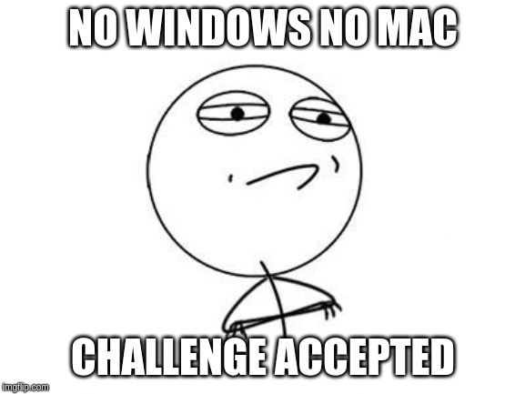
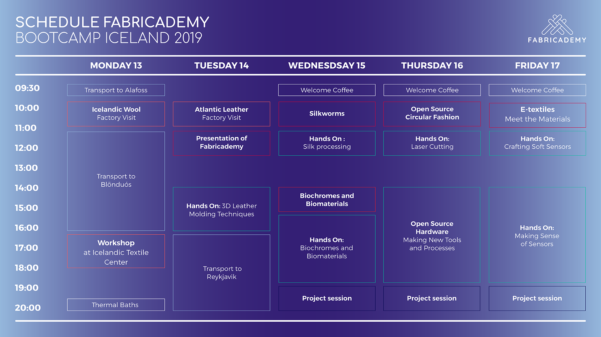

# Bootcamp documentation

I read in the [Handbook for the participants](http://fabricademy.fabcloud.io/bootcamp2019) that is recommended to bring a computer with Illustrator, Rhino and Fusion360. I wonder what are those things. I will try to complete the bootcamp using only Linux software.

So this is the plan

## Alafoss wool factory

## Blon

## Atlantic leather factory

## Introduction to fabricademy

Inspirations of Cecilia and Anastasia

- Erns Haeckel art forms
- Biblio odissey
- Wikimedia Commons

Multidisciplinary program. Open course available in [Vimeo](class.textile-academy.org) freely. 13 weeks od lectures followed by 12 weeks of project development. Mindset change about open knowledge, sharing economy, versus intellectual property protection.

Fabricademy official program:

- 24 September classes start
- 16 dec final project proposals
- March 2020 Final project presentations

Program overview

- 3. Body scanning
- 4. Natural dyes
- 5. Bateria dyes
- 6. E-textiles. Soft sensors
- 7. 3D modelling computational couture
- 8. Texture scaffold
- 9. Open source hardware
- 10. Wearables
- 11. Implications and applications
- 12. Soft Robotics
- 13. Skin electronics

Thingiverse for textiles 

No pattern making class. Another 2 weeks course before in the lab to put everyone in the same page.